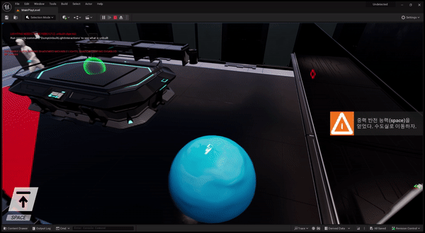
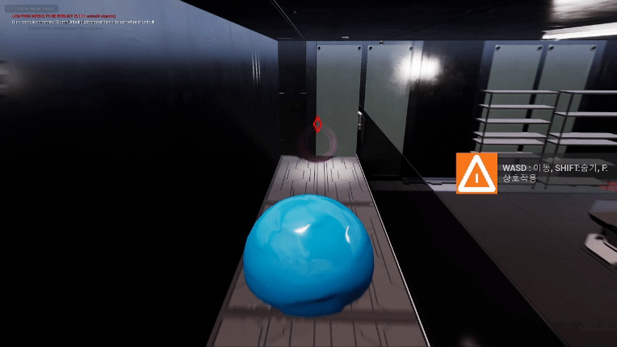
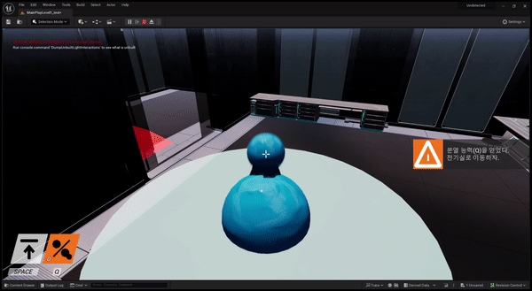
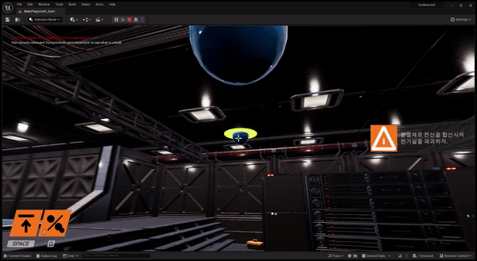

# Portfolio

<!DOCTYPE html>
<html lang="ko">
<head>
    <meta charset="UTF-8">
    <meta name="viewport" content="width=device-width, initial-scale=1.0">
    <title>포트폴리오</title>
</head>
<body>
    <h1>포트폴리오</h1>

    <h2>언리얼 엔진</h2>

    <h3>슬라임 탈출 게임</h3>
    <ul>
        <li><strong>개요</strong>: 2023년 2학기에 진행한 게임엔진 기초 수업 프로젝트로, 5인 구성 팀으로 개발되었으며 저는 캐릭터(슬라임과 인간)를 담당했습니다. 이 게임은 실험실에서 실험 당한 슬라임이 탈출하는 것을 주제로 합니다.</li>
        <li><strong>게임 배경 설명</strong>: “당신은 연구실에서 실험 당하던 슬라임입니다. 어느 날 지능이 생긴 당신은 끔찍한 실험을 피하기 위해 이 곳을 탈출하기로 결심했습니다. 주변의 능력들을 흡수해 곳곳에 깔린 연구원과 무장 경비원을 기만하고 탈출하는 게임입니다. 많은 수의 경비원들을 기만하기 위해서는 천장에 숨고, 웅크려서 투명해지는 등, 3D 공간을 잘 활용해야 합니다. 탈출에 성공하기 위해서는 능력을 얻어 기만 수단을 얻고 적의 행동 패턴을 잘 파악해야 합니다.”</li>
        <li><strong>캐릭터 능력</strong>:
            <ul>
                <li>이동: W, A, S, D 키를 사용하여 슬라임을 움직입니다.</li>
                
                <li>웅크리기: 왼쪽 Shift 키를 사용하여 슬라임을 납작하게 변형하여 숨을 수 있습니다.</li>
                
                <li>상호작용: F 키를 사용하여 능력을 획득할 수 있습니다.</li>
                
                <li>중력 반전: Space Bar를 사용하여 슬라임의 중력을 반전시킵니다.</li>
                
                <li>분열 및 회수: Q 키를 사용하여 슬라임의 본체를 분열하거나 회수합니다.</li>
                
                
                <li>기생 및 탈출: E 키를 사용하여 연구원에 기생하거나 숙주로부터 탈출합니다.</li>
                
            </ul>
        </li>
        <li><strong>게임 트레일러 영상</strong>: <a href="https://www.youtube.com/watch?v=WFChHSS6D90">링크</a></li>
        <iframe width="560" height="315" src="https://www.youtube.com/embed/WFChHSS6D90" frameborder="0" allowfullscreen></iframe>
        <li><strong>슬라임 테스트 영상</strong>: <a href="https://www.youtube.com/watch?v=WFChHSS6D90">링크</a></li>
        <iframe width="560" height="315" src="https://www.youtube.com/embed/P7Wj2JRKNJE?si=RFdAUa8XxoEOxIm2" frameborder="0" allowfullscreen></iframe>
    </ul>

    <h2>Pygame</h2>

    <h3>Snake 탄막 슈팅 게임</h3>
    
개요: 2023년 2학기 게임프로그래밍입문 수업 개인 과제로 개발한 프로젝트입니다. 전통적인 Snake 게임을 탄막 슈팅 게임으로 변형시켰습니다. 플레이어는 총알과 폭탄을 사용하여 다양한 적과 장애물을 피하고 제거해야 합니다.

    <iframe width="560" height="315" src="https://www.youtube.com/embed/545ytAmNCAk?si=T8iy5rRduvQQkVcM" frameborder="0" allowfullscreen></iframe>
    
    <h3>Inverse Kinematics를 이용한 2D Procedural Animation 생성</h3>
    
개요: 2023년 2학기 게임프로그래밍입문 수업 개인 과제로 개발한 프로젝트입니다. Inverse Kinematics를 사용하여 거미 캐릭터를 만들었습니다. 캐릭터의 다리는 주변 지형에 맞게 위치하며 키보드로 거미를 조작할 수 있습니다.

    <iframe width="560" height="315" src="https://www.youtube.com/embed/DsYfsclIrRA?si=PxTYjhxzkE7rtKDe" frameborder="0" allowfullscreen></iframe>

    <h3>암벽 등반 게임</h3>
    
개요: 하늘에서 떨어지는 암벽을 올라가는 것이 목표인 게임입니다. 플레이어는 2단 점프, 대쉬 등의 기술을 사용하여 암벽을 오르며, 바닥이나 비수와 충돌하면 사망합니다.

    <iframe width="560" height="315" src="https://www.youtube.com/embed/S4ylL_r_qiM?si=2hL5YbEr-Fy7jUPo" frameborder="0" allowfullscreen></iframe>
</body>
</html>
